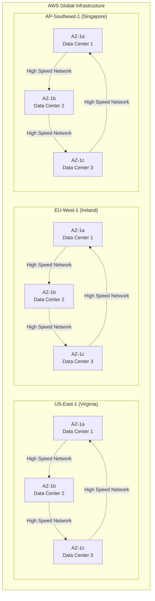
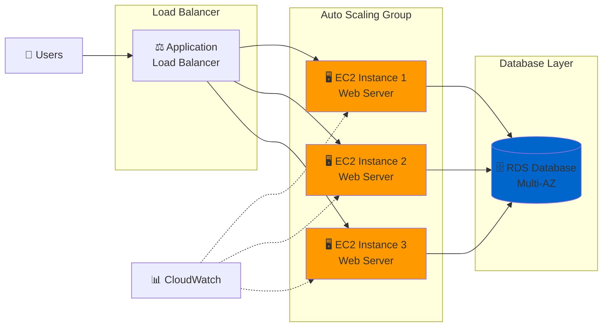
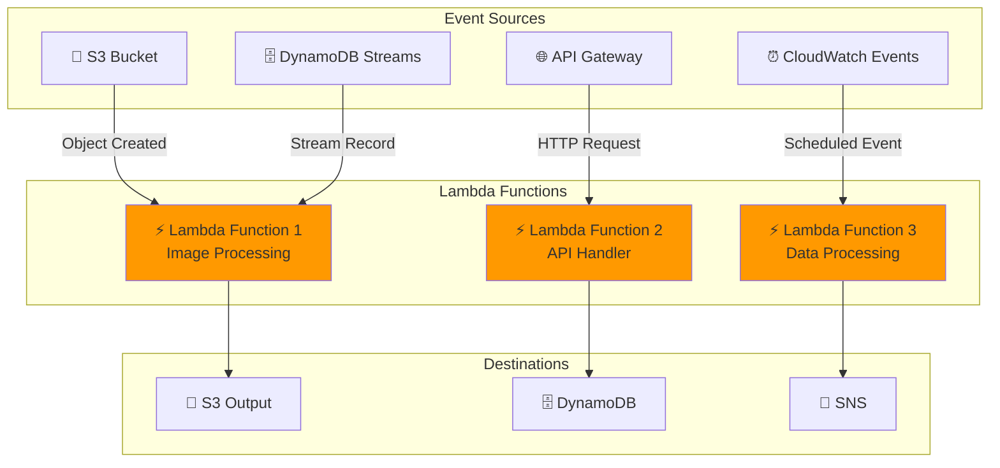
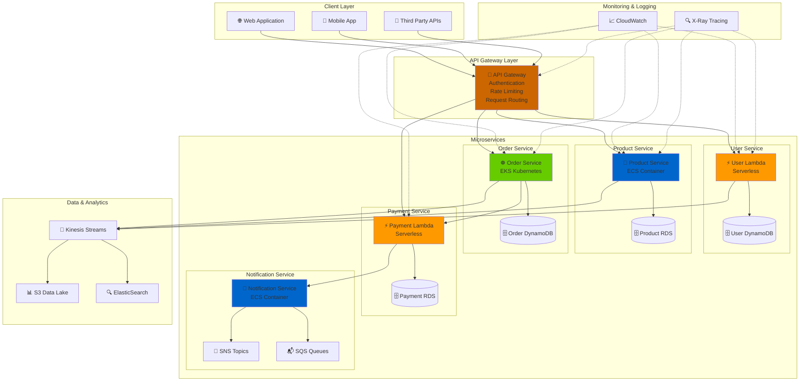
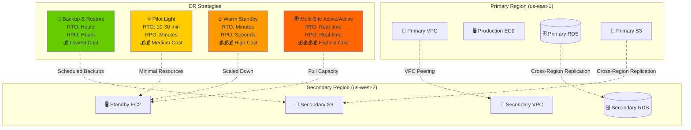
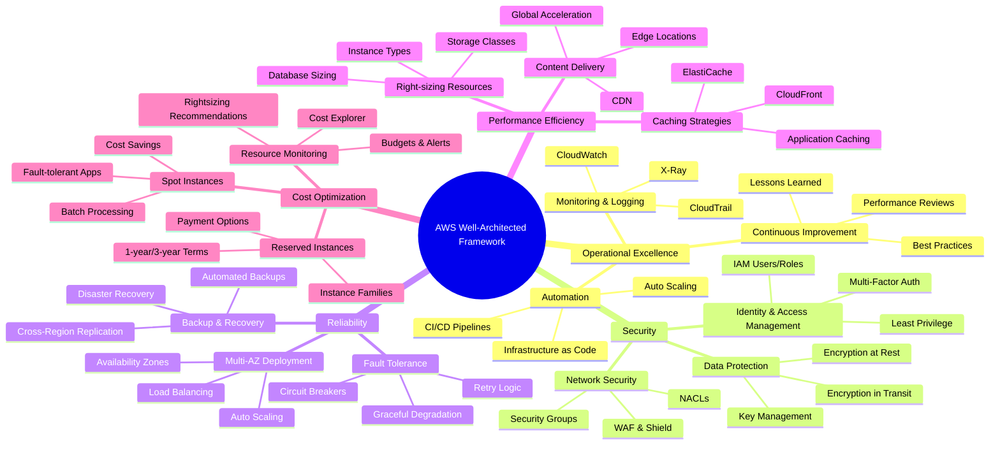

# Amazon Web Services (AWS) İnfrastrukturunun Arxitekturası

## Giriş

Amazon Web Services (AWS) dünyanın ən böyük və ən geniş istifadə olunan bulud platformasıdır. Bu sənəd AWS infrastrukturunun əsas arxitektura komponentlərini və onların necə işlədiyini izah edir.

## AWS-in Əsas Arxitektura Komponentləri

### 1. Regionlar (Regions)

AWS infrastrukturu dünya üzrə **regionlara** bölünmüşdür:

- **Region nədir?** - Müstəqil coğrafi ərazidə yerləşən data mərkəzlərinin toplusu
- **Xüsusiyyətləri:**
  - Hər region digər regionlardan tam izolə edilmişdir
  - Yüksək mövcudluq və davamlılıq təmin edir
  - Məlumatlar regionlar arasında avtomatik olaraq köçürülmür
  - Hər regionda minimum 3 Availability Zone var



### 2. Mövcudluq Zonaları (Availability Zones - AZ)

- **AZ nədir?** - Bir region daxilində ayrı-ayrı data mərkəzləri
- **Xüsusiyyətləri:**
  - Hər AZ fiziki olaraq ayrıdır
  - Yüksək sürətli şəbəkə ilə bağlıdır
  - Təbii fəlakətlərə qarşı müqavimət
  - Redundancy və fault tolerance təmin edir

### 3. Edge Locations və CloudFront

- **Edge Location:** İstifadəçilərə yaxın məzmun çatdırma nöqtələri
- **CloudFront:** AWS-in Content Delivery Network (CDN) xidməti
- **Faydaları:**
  - Aşağı latency
  - Yüksək transfer sürəti
  - Global məzmun paylanması

## Əsas AWS Xidmətləri və Arxitektura

### 1. Hesablama Xidmətləri (Compute Services)

#### Amazon EC2 (Elastic Compute Cloud)
```
┌─────────────────┐    ┌─────────────────┐    ┌─────────────────┐
│   Web Server    │    │  App Server     │    │   Database      │
│     (EC2)       │────│     (EC2)       │────│     (RDS)       │
│                 │    │                 │    │                 │
└─────────────────┘    └─────────────────┘    └─────────────────┘
```



- Virtual maşınlar (instances)
- Müxtəlif instance növləri
- Auto Scaling imkanları
- Load Balancing

#### AWS Lambda


- Serverless hesablama
- Event-driven arxitektura
- Avtomatik miqyaslama
- Pay-per-use model

### 2. Yaddaş Xidmətləri (Storage Services)

#### Amazon S3 (Simple Storage Service)
```
┌─────────────────────────────────────────────────────────────┐
│                        S3 Bucket                           │
├─────────────────┬─────────────────┬─────────────────────────┤
│   Standard      │   Infrequent    │      Glacier            │
│   Storage       │   Access        │   (Archive)             │
└─────────────────┴─────────────────┴─────────────────────────┘
```



```mermaid
graph TB
    subgraph "S3 Storage Classes"
        Standard[📦 S3 Standard<br/>Frequent Access<br/>99.999999999% Durability]
        IA[📦 S3 Infrequent Access<br/>Less Frequent Access<br/>Lower Cost]
        Glacier[🧊 S3 Glacier<br/>Archive Storage<br/>Very Low Cost]
        DeepArchive[❄️ S3 Glacier Deep Archive<br/>Long-term Archive<br/>Lowest Cost]
    end
    
    subgraph "Lifecycle Management"
        Upload[📤 Upload Objects]
        Transition1[⏰ 30 Days]
        Transition2[⏰ 90 Days]
        Transition3[⏰ 365 Days]
    end
    
    subgraph "Access Patterns"
        WebApp[🌐 Web Applications]
        Backup[💾 Backup & Archive]
        Analytics[📊 Big Data Analytics]
        CDN[🌍 CloudFront CDN]
    end
    
    Upload --> Standard
    Standard -->|After 30 days| IA
    IA -->|After 90 days| Glacier
    Glacier -->|After 365 days| DeepArchive
    
    WebApp --> Standard
    Backup --> Glacier
    Analytics --> Standard
    CDN --> Standard
    
    Standard -.->|Lifecycle Rule| Transition1
    Transition1 -.-> Transition2
    Transition2 -.-> Transition3
    
    style Standard fill:#ff9900
    style IA fill:#ff6600
    style Glacier fill:#0066cc
    style DeepArchive fill:#003366
```

- Object storage
- 99.999999999% (11 9's) davamlılıq
- Müxtəlif storage class-ları
- Versioning və lifecycle management

#### Amazon EBS (Elastic Block Store)
- EC2 üçün persistent storage
- Snapshot imkanları
- Müxtəlif performans səviyyələri

### 3. Verilənlər Bazası Xidmətləri (Database Services)

#### Amazon RDS (Relational Database Service)
- Managed relational databases
- Multi-AZ deployment
- Read replicas
- Automated backups

#### Amazon DynamoDB
- NoSQL database
- Serverless
- Global tables
- Auto scaling

### 4. Şəbəkə və Məzmun Çatdırma

#### Amazon VPC (Virtual Private Cloud)
```
┌─────────────────────────────────────────────────────────────┐
│                        VPC                                  │
│  ┌─────────────────┐              ┌─────────────────┐      │
│  │  Public Subnet  │              │ Private Subnet  │      │
│  │                 │              │                 │      │
│  │  ┌───────────┐  │              │  ┌───────────┐  │      │
│  │  │    EC2    │  │              │  │    RDS    │  │      │
│  │  └───────────┘  │              │  └───────────┘  │      │
│  └─────────────────┘              └─────────────────┘      │
└─────────────────────────────────────────────────────────────┘
```

```mermaid
graph TB
    subgraph "Internet"
        Internet[🌐 Internet]
    end
    
    subgraph "VPC (10.0.0.0/16)"
        subgraph "Availability Zone A"
            subgraph "Public Subnet A (10.0.1.0/24)"
                WebServer1[🖥️ Web Server<br/>EC2 Instance]
                NAT1[🔄 NAT Gateway]
            end
            
            subgraph "Private Subnet A (10.0.3.0/24)"
                AppServer1[⚙️ App Server<br/>EC2 Instance]
                DB1[(🗄️ RDS Primary<br/>Database)]
            end
        end
        
        subgraph "Availability Zone B"
            subgraph "Public Subnet B (10.0.2.0/24)"
                WebServer2[🖥️ Web Server<br/>EC2 Instance]
                NAT2[🔄 NAT Gateway]
            end
            
            subgraph "Private Subnet B (10.0.4.0/24)"
                AppServer2[⚙️ App Server<br/>EC2 Instance]
                DB2[(🗄️ RDS Standby<br/>Database)]
            end
        end
        
        IGW[🚪 Internet Gateway]
        ALB[⚖️ Application Load Balancer]
        
        subgraph "Security"
            SG_Web[🛡️ Web Security Group<br/>Port 80, 443]
            SG_App[🛡️ App Security Group<br/>Port 8080]
            SG_DB[🛡️ DB Security Group<br/>Port 3306]
        end
    end
    
    Internet --> IGW
    IGW --> ALB
    ALB --> WebServer1
    ALB --> WebServer2
    
    WebServer1 --> AppServer1
    WebServer2 --> AppServer2
    
    AppServer1 --> DB1
    AppServer2 --> DB1
    DB1 -.->|Replication| DB2
    
    AppServer1 --> NAT1
    AppServer2 --> NAT2
    NAT1 --> IGW
    NAT2 --> IGW
    
    SG_Web -.-> WebServer1
    SG_Web -.-> WebServer2
    SG_App -.-> AppServer1
    SG_App -.-> AppServer2
    SG_DB -.-> DB1
    SG_DB -.-> DB2
    
    style WebServer1 fill:#ff9900
    style WebServer2 fill:#ff9900
    style AppServer1 fill:#66cc00
    style AppServer2 fill:#66cc00
    style DB1 fill:#0066cc
    style DB2 fill:#0066cc
```

### 2. Microservices Arxitekturası
```
┌─────────────────┐    ┌─────────────────┐
│   API Gateway   │────│   Lambda        │
└─────────┬───────┘    └─────────────────┘
          │
┌─────────▼───────┐    ┌─────────────────┐
│   ECS/EKS       │────│   DynamoDB      │
│  (Containers)   │    │                 │
└─────────────────┘    └─────────────────┘
```



## Disaster Recovery Strategiyaları



## AWS Well-Architected Framework



### 5 Əsas Prinsip:

1. **Operational Excellence (Əməliyyat Mükəmməlliyi)**
   - Monitoring və logging
   - Automation
   - Continuous improvement

2. **Security (Təhlükəsizlik)**
   - Identity and Access Management (IAM)
   - Data encryption
   - Network security

3. **Reliability (Etibarlılık)**
   - Multi-AZ deployment
   - Backup və disaster recovery
   - Auto scaling

4. **Performance Efficiency (Performans Səmərəliliyi)**
   - Right-sizing resources
   - Caching strategies
   - Content delivery optimization

5. **Cost Optimization (Xərc Optimallaşdırması)**
   - Reserved instances
   - Spot instances
   - Resource monitoring

## Təhlükəsizlik Arxitekturası

### Identity and Access Management (IAM)
- Users, Groups, Roles
- Policies və permissions
- Multi-Factor Authentication (MFA)
- Cross-account access

### Şəbəkə Təhlükəsizliyi
- Security Groups (Stateful firewall)
- Network ACLs (Stateless firewall)
- AWS WAF (Web Application Firewall)
- AWS Shield (DDoS protection)

### Data Encryption
- Encryption at rest
- Encryption in transit
- AWS KMS (Key Management Service)
- CloudHSM

## Monitoring və Logging

### Amazon CloudWatch
- Metrics və alarms
- Log aggregation
- Dashboards
- Auto scaling triggers

### AWS CloudTrail
- API call logging
- Compliance və audit
- Security analysis

### AWS X-Ray
- Distributed tracing
- Performance analysis
- Debugging

### 1. Backup və Restore
- RTO: Saatlar
- RPO: Dəqiqələr/saatlar
- Ən aşağı xərc

### 2. Pilot Light
- RTO: 10-30 dəqiqə
- RPO: Dəqiqələr
- Orta xərc

### 3. Warm Standby
- RTO: Dəqiqələr
- RPO: Saniyələr
- Yüksək xərc

### 4. Multi-Site Active/Active
- RTO: Real-time
- RPO: Real-time
- Ən yüksək xərc

## Best Practices

### 1. Design Principles
- **Automate everything** - Mümkün olan hər şeyi avtomatlaşdırın
- **Treat infrastructure as code** - Infrastructure as Code (IaC) istifadə edin
- **Design for failure** - Uğursuzluq üçün dizayn edin
- **Implement security at every layer** - Hər səviyyədə təhlükəsizlik

### 2. Cost Optimization
- Reserved Instances istifadə edin
- Spot Instances-dan faydalanın
- Right-sizing edin
- Unused resources-ları silin
- CloudWatch ilə monitoring edin

### 3. Performance
- Caching strategiyalarından istifadə edin
- CDN (CloudFront) istifadə edin
- Database indexing
- Auto Scaling konfiqurasiya edin

## Nəticə

AWS infrastrukturu yüksək mövcudluq, miqyaslanabilirlik və təhlükəsizlik təmin edən mürəkkəb bir sistemdir. Düzgün arxitektura dizaynı ilə:

- **Yüksək performans** əldə edə bilərsiniz
- **Xərcləri optimize** edə bilərsiniz  
- **Təhlükəsizliyi** təmin edə bilərsiniz
- **Davamlılığı** artıra bilərsiniz

Bu sənəd AWS infrastrukturunun əsas komponentlərini əhatə edir. Daha ətraflı məlumat üçün AWS rəsmi sənədlərinə müraciət edin.

---

**Qeyd:** Bu sənəd AWS infrastrukturunun ümumi baxışını təqdim edir. Konkret layihələr üçün daha ətraflı arxitektura dizaynı tələb oluna bilər.
